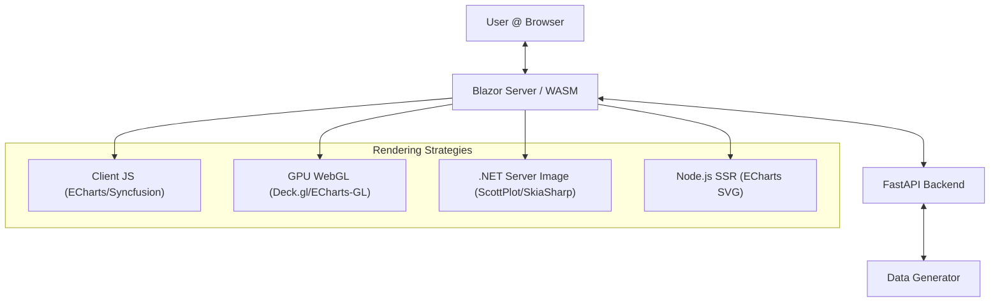
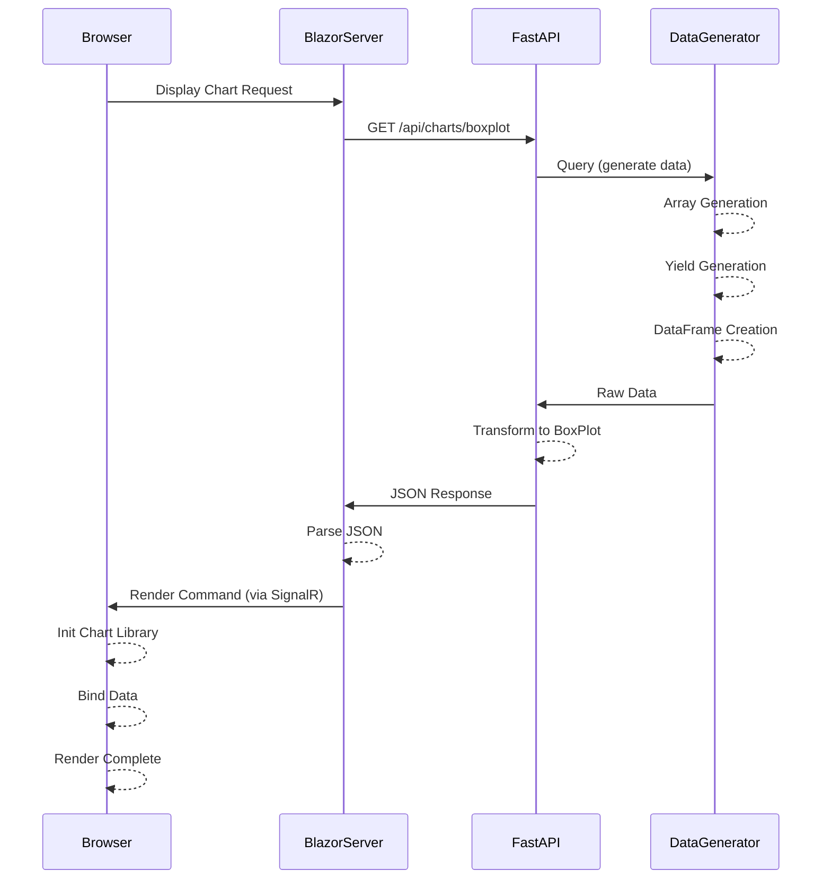

# 📊 Massive Data Charting Framework

A hybrid, high-performance charting framework designed to benchmark and visualize massive datasets (up to 1M+ points) using various rendering strategies.

## 🚀 Key Features

*   **Hybrid Rendering Architecture**: Support for Client-side, Server-side, and GPU-accelerated rendering.
*   **Massive Data Handling**: Optimized for datasets ranging from 1,000 to 1,000,000+ data points.
*   **Detailed Performance Metrics**: Granular tracking of server generation, network latency, parsing, and rendering times.
*   **Modular Adapters**: easily swappable chart implementations.

## 🏗️ Architecture

The solution maps a modern full-stack application data flow:



### Rendering Modes

| Mode | Technology | Best For | Architecture |
|------|------------|----------|--------------|
| **Browser JS** | Apache ECharts, Syncfusion | Standard interactivity, <10k points | `Browser ← JSON` |
| **GPU WebGL** | Deck.gl, ECharts-GL | Massive datasets (100k+), Performance | `Browser (GPU) ← JSON` |
| **True SSR (.NET)** | ScottPlot, OxyPlot, SkiaSharp | Static reports, Low-power devices | `Server (.NET) → PNG Image` |
| **Node.js SSR** | ECharts (SVG) | Headless benchmarks, Vector quality | `Server (Node) → SVG String` |

## 🛠️ Prerequisites

*   **.NET 8.0 SDK** (for Frontend)
*   **Python 3.10+** (for Backend API)
*   **Node.js v18+** (for ECharts SSR)

## 📦 Setup & Run

### 1. Start Backend API
The FastAPI backend generates the mock semiconductor data.

```bash
cd backend
pip install -r requirements.txt
uvicorn main:app --reload --port 8000
```
*API docs available at: http://localhost:8000/docs*

### 2. Start Frontend
You can run either the **Blazor Server** (recommended for SSR testing) or **Blazor WASM** project.

**Blazor Server:**
```bash
cd frontend/ChartTestFramework.Server
dotnet run
```
*App runs at: http://localhost:5000*

## ⚡ Performance Analysis Flow

We capture timing metrics at every stage of the lifecycle:



### Metrics Definitions
*   **Server Data Gen**: Time taken by Python backend to generate raw numpy arrays.
*   **Server Transform**: Time to reshape data into boxplot statistics (min, q1, median, q3, max).
*   **Network Fetch**: Time for Blazor to receive the HTTP response.
*   **Parse JSON**: Time to deserialize JSON into C# objects.
*   **Render**: Time for the specific library to paint pixels on the screen.

## 🧬 ECharts SSR (Node.js) Implementation

We implemented a "Sidecar" pattern for true ECharts SSR:
1.  **.NET** spawns a background `node` process.
2.  **Pipes** the chart configuration JSON via `stdin`.
3.  **Node.js** renders the chart to an SVG string using ECharts' server-side mode.
4.  **Returns** the SVG string via `stdout` to .NET.
5.  **.NET** injects the SVG directly into the DOM.

This allows Apple-to-Apples comparison between Client-side ECharts and Server-side ECharts.

## 🔌 How to Add a New Library

The framework is designed to be extensible. Follow these 4 steps to add a new charting library:

### 1. Create an Adapter
Create a new class in `frontend/Shared/Adapters/` that implements the `IChartAdapter` interface.

```csharp
public class MyNewChartAdapter : IChartAdapter
{
    public string Name => "My New Library";
    
    // Implement rendering logic
    public async Task<RenderMetrics> RenderBoxPlot(string containerId, BoxPlotData data)
    {
        // 1. Convert data to library format
        // 2. Invoke JS Interop or Server Generation
        // 3. Return metrics
    }
}
```

### 2. Register Service
Register your adapter in `frontend/ChartTestFramework.Server/Program.cs`:

```csharp
builder.Services.AddScoped<MyNewChartAdapter>();
```

### 3. Update Factory
Add your library to the switch statement in `Program.cs` to allow dynamic selection:

```csharp
"MyNewLib" => sp.GetRequiredService<MyNewChartAdapter>(),
```

### 4. Add UI Option
Add an option to the dropdown in `frontend/ChartTestFramework.Server/Components/Pages/Home.razor`:

```html
<option value="MyNewLib">My New Library</option>
```

---
*Generated by Antigravity Agent*
